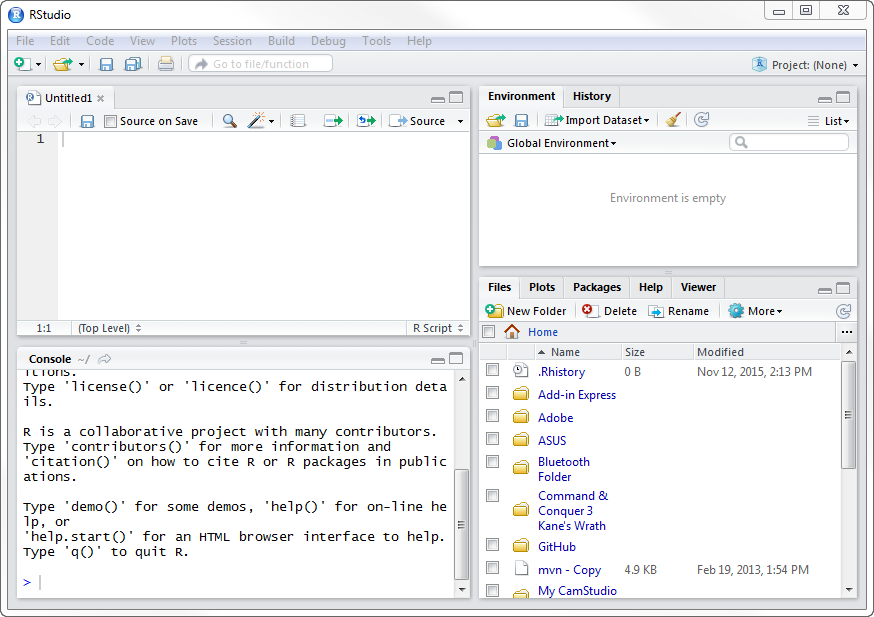
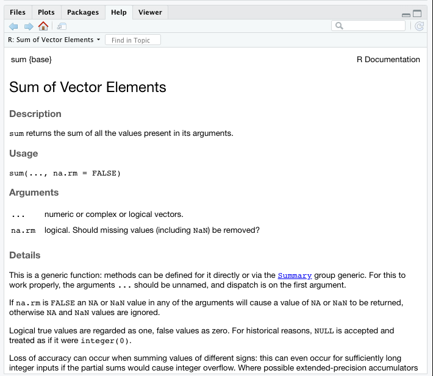

## Learning Objectives

-   Describe what R is.
-   Interact with R using RStudio.
-   Familiarize with RStudio components.
-   Describe data types and define variables

## Introduction

This training is a first in a series for our 2022 “Series on
Bioinformatics” starting April 27th, 2022. This is a great opportunity
to build the skills needed to succeed in bioinformatics from the ground
up. The workshops will be taught by postdocs with years of experience in
bioinformatics.

## What is R?

-   Free and open-source programming language
-   Used for statistics and data visualization
-   Important for science, business, education, etc.
-   Considered an in-demand skill to learn

## Comprehensive R Archive Network (CRAN)

-   [Comprehensive R Archive Network](https://cran.r-project.org), also
    known as CRAN.
-   CRAN is R’s central software repository, supported by the R
    Foundation
-   Network of ftp and web servers store identical, up-to-date, versions
    of code and documentation for R
-   Hosts many add-on packages used to extend the functionality of R

## What is RStudio?

-   RStudio is an open source Integrated Development Environment (IDE)
-   Rather than using a terminal, RStudio provides a graphical user
    interface that is platform agnostic and integrates additional
    packages, project management, version control, and notebooks.

## Getting started with R and RStudio

-   Install R from [CRAN](https://cran.r-project.org)
-   There are versions for many operating systems
-   Install RStudio Desktop from
    [Rstudio](https://www.rstudio.com/products/rstudio/download/#download)

### RStudio Basics

Once you open RStudio, you will see four main panes. Each will contain
different information. You can see my screen below.

Starting from the top left pane and going from left to right, we have
the descriptions of each pane below:

1.  **Source Editor**: This pane is where you can write R scripts or
    notebooks. You can write in other programming languages if you
    wanted to as well. Each document will have its own tab. Code written
    here can be run with the `Run` command.
2.  **Environment**: This pane displays objects, variables, and
    functions that are generated in your R session. There is also a
    history of all code that was run.
3.  **Console**: This pane is where you can type commands and
    interactively run R code. The output will display in the console.
4.  **Files, Plots, Packages, Help, Viewer**: This pane has several tabs
    that are important.
    -   *Files*: This tab shows the structure and content of a directory
        on your computer. This could be your working directory or a
        directory that you manually navigated to.
    -   *Plots*: This tab will display plots or figures as an output
        from the console.
    -   *Packages*: This tab contains a list of all packages that are
        installed. Packages that are loaded in your R session will have
        a checked box.
    -   *Help*: This tab reveals the help pages for an R package or
        function.
    -   *Viewer*: This tab shows compiled R Markdown documents.

### Starting a new project in RStudio

When working with R, it is always a good idea to create a new project
directory. This will help you keep your files and data organized by
project.

To get started:

1.  Open RStudio
2.  Go to the File menu and select New Project.
3.  In the New Project window, choose New Directory. Then, choose New
    Project. Name your new directory. You can use a name like,
    Basics-in-R, and then “Create the project as sub directory of:” in a
    location of your choice.
4.  Click on Create Project.
5.  The project should open up automatically in Rstudio.

We can view our working directory by using the function `getwd()`

    getwd()

Your working directory will be the location where R will automatically
look for files. If you want to find files in a different location, you
will either need to provide the full path or type the path in relation
to the working directory. Files that you output will automatically save
into your working directory unless a path is provided.

To organize your working directory, it is highly recommended to generate
sub-folders like `data/` or `results/`. You can do so in the Files tab
and select `New Folder`.

### Basic math calculations in R

Below are some of the most common math calculations that can be done in
R.

<table>
<thead>
<tr class="header">
<th>Operation</th>
<th>Symbol</th>
</tr>
</thead>
<tbody>
<tr class="odd">
<td>Addition</td>
<td><code>a + b</code></td>
</tr>
<tr class="even">
<td>Subtraction</td>
<td><code>a - b</code></td>
</tr>
<tr class="odd">
<td>Multiplication</td>
<td><code>a * b</code></td>
</tr>
<tr class="even">
<td>Division</td>
<td><code>a / b</code></td>
</tr>
<tr class="odd">
<td>Exponent</td>
<td><code>a ^ b</code></td>
</tr>
<tr class="even">
<td>Remainder</td>
<td><code>a %% b</code></td>
</tr>
<tr class="odd">
<td>Integer Division</td>
<td><code>a %/% b</code></td>
</tr>
</tbody>
</table>

For instance, here is an example of addition.

    5 + 3

------------------------------------------------------------------------

**Exercise**

1.  Use R as a calculate and find the square root of 10

------------------------------------------------------------------------

### Functions in R

R has several pre-built functions. For instance, we can use `sum()`
instead of the `+` symbol for addition.

    sum(1,3) #This gives the sum of 1 and 3

We can also call the *R documentation* for a function by using `?`
before the function name. The documentation will show up under the Help
tab. It contains information regarding description, usage, and arguments
for a function.

    ?sum #Find the R Documentation for sum()

------------------------------------------------------------------------

**Exercise**

1.  Use `sum()` to add the numbers 10, 20, 30, 40, and 50.

------------------------------------------------------------------------

### Math functions in R

In addition to the basic calculations, there are many common pre-built
math functions in R.

<table>
<thead>
<tr class="header">
<th>Operation</th>
<th>Function</th>
</tr>
</thead>
<tbody>
<tr class="odd">
<td>Square root</td>
<td><code>sqrt()</code></td>
</tr>
<tr class="even">
<td>Logarithm</td>
<td><code>log()</code></td>
</tr>
<tr class="odd">
<td>Logarithm, base 10</td>
<td><code>log10()</code></td>
</tr>
<tr class="even">
<td>Exponential</td>
<td><code>exp()</code></td>
</tr>
<tr class="odd">
<td>Summation</td>
<td><code>sum()</code></td>
</tr>
<tr class="even">
<td>Round</td>
<td><code>round()</code></td>
</tr>
<tr class="odd">
<td>Mean</td>
<td><code>mean()</code></td>
</tr>
<tr class="even">
<td>Median</td>
<td><code>median()</code></td>
</tr>
<tr class="odd">
<td>Minimum</td>
<td><code>min()</code></td>
</tr>
<tr class="even">
<td>Maximum</td>
<td><code>max()</code></td>
</tr>
</tbody>
</table>

    #What is the square root of 10?
    sqrt(10)

------------------------------------------------------------------------

**Exercise**

1.  Find the round the summation of 10.13 and 53.535 to one decimal
    place.
2.  Hint: try `?round` for help.

------------------------------------------------------------------------

### Defining variables

A key aspect of programming is defining variables. We store data or
values as variables so that we can use in other functions or recall it
at a later time. It allows us to save time by storing the data and not
having to re-calculate it again. R has two *assignment operators* for
defining variables: `<-` and `=`. The operator `<-` can be used
anywhere, whereas the operator `=` is only allowed at the top level.

    x <- 1
    y <- 15.3

Let’s add `x` and `y`.

    #What is in x + y?
    x + y 

Importantly, when defining variable names, ensure that you use an
*informative* name. This enables yourself and others when reviewing code
to know how the variable was used. For instance, we used `x` and `y` in
the examples, but their meaning is unknown. Something like
`country_population` or `room_capacity` provides better definition for a
variable.

### R Data Types

There are different types of data in R, which can be stored as a
variable. Below is a table of some of the most commonly used data types.

<table>
<thead>
<tr class="header">
<th>Data Type</th>
<th>Definition</th>
<th>Example</th>
</tr>
</thead>
<tbody>
<tr class="odd">
<td>numeric</td>
<td>Any number value</td>
<td><code>3.14</code></td>
</tr>
<tr class="even">
<td>integer</td>
<td>Any whole number value</td>
<td><code>42</code></td>
</tr>
<tr class="odd">
<td>character</td>
<td>Any number of ASCII characters</td>
<td><code>"Hello world!"</code></td>
</tr>
<tr class="even">
<td></td>
<td>defined within quotation marks</td>
<td></td>
</tr>
<tr class="odd">
<td>logical</td>
<td>A value of <code>TRUE</code> or <code>FALSE</code></td>
<td><code>TRUE</code></td>
</tr>
<tr class="even">
<td>factor</td>
<td>A categorical type of data</td>
<td><code>#&gt; [1] Male Male Male Female Female</code></td>
</tr>
<tr class="odd">
<td></td>
<td></td>
<td><code>#&gt; Levels: Male Female</code></td>
</tr>
</tbody>
</table>

The function `class()` can be used to find out the type of data that you
are dealing with.

    x <- 3
    class(x)

    x <- TRUE
    class(x)

### Relational and Logical Operators

In R, there are relational operators that compare values between two
variables. Typically, these are numerical equalities or inequalities.
The result of comparison is a Boolean value.

<table>
<thead>
<tr class="header">
<th>Operator</th>
<th>Description</th>
</tr>
</thead>
<tbody>
<tr class="odd">
<td><code>&lt;</code></td>
<td>less than</td>
</tr>
<tr class="even">
<td><code>&lt;=</code></td>
<td>less than or equal to</td>
</tr>
<tr class="odd">
<td><code>&gt;</code></td>
<td>greater than</td>
</tr>
<tr class="even">
<td><code>&gt;=</code></td>
<td>greater than or equal to</td>
</tr>
<tr class="odd">
<td><code>==</code></td>
<td>equal to</td>
</tr>
<tr class="even">
<td><code>!=</code></td>
<td>not equal to</td>
</tr>
<tr class="odd">
<td><code>%in%</code></td>
<td>is ‘in’ a given vector</td>
</tr>
</tbody>
</table>

    #Is 3 greater than 5?
    3 > 5

There are also logical operators which connect two or more expressions
depending on the meaning of the operator. These are typically combined
with relational operators.

<table>
<thead>
<tr class="header">
<th>Operator</th>
<th>Description</th>
</tr>
</thead>
<tbody>
<tr class="odd">
<td><code>|</code></td>
<td>OR</td>
</tr>
<tr class="even">
<td><code>&amp;</code></td>
<td>AND</td>
</tr>
<tr class="odd">
<td><code>!</code></td>
<td>NOT</td>
</tr>
</tbody>
</table>

    #Is 3 greater than 1 and 5?
    3 > 1 & 3 > 5

    #Is 3 greater than 1 or 5?
    3 > 1 | 3 > 5

## R Data Objects

### Vectors

Vectors are a data structure in R containing one or more values. In
fact, you may have noticed a `[1]` in the output of `x`. This indicates
that it is a vector of length `1`.

    length(x) #This function gives you the length of a vector

We use the function `c()` to define a vector with multiple elements. The
`c` stands for combine.

    my_first_vector <- c(1,2,3,4,5) #We can also do this with the following, 1:5 instead of c()
    my_first_vector

We can add more elements to the same vector.

    my_first_vector <- c(my_first_vector, 6,7)
    my_first_vector

We can call specific elements in a vector by using a process called
*indexing*. Basically, we can subset specific elements of a vector for
further analysis. We do this by defining which position we want in
brackets `[]` after the vector.

    #Let's take out the 3rd element
    my_first_vector[3]

What if we wanted to select multiple elements? We can use another vector
with the positions we want.

    #Let's take out the 2nd and 4th elements
    my_first_vector[c(2,4)]

We can also do the opposite and select all elements but a single or
multiple element by using `-`.

    #Let's keep all but the 5th element
    my_first_vector[-5]

    #Let's keep all but the 1st and 3rd elements
    my_first_vector[-c(1,3)]

Importantly, R functions are typically *vectorized*. This means that the
function will perform its operation on all elements of the vector
without having to loop through for each element.

    my_first_vector
    my_first_vector * 2

We can also test some of math functions we listed above.

    mean(my_first_vector) #This gives the mean of a numeric vector
    min(my_first_vector) #This gives the minimum numeric value in a vector
    max(my_first_vector) #This gives the maximmum numeric value in a vector

### Matrices

Matrices are vectors with a dimension attribute. The dimension attribute
tells us how many rows and columns the matrix has.

The `matrix()` function is used to create a function. We provide the
values, \# of rows and \# of columns.

    #matrix of sequence 1 to 6 with two rows and three columnss
    my_matrix <- matrix(1:6, nrow = 2, ncol = 3) 
    print(my_matrix)

    dim(my_matrix)

    my_matrix[1,2] #first row and second column

Matrices can be created by adding vectors using `cbind()`

    vector_1 <- c(1,2,3,4)
    vector_2 <- c(2,3,4,5)

    matrix_1 <- cbind(vector_1, vector_2)
    print(matrix_1)

------------------------------------------------------------------------

**Exercise**

1.  Create a matrix containing a sequence from 1 to 10 with 5 rows and 2
    columns
2.  Add a row vector of values c(3,5) to the matrix

------------------------------------------------------------------------

### List

Lists are a special type of vector or R object can contain elements of
different classes.

Lists can be explicitly created using the `list()` function.

    my_list <- list('I love science!', 1, TRUE)
    print(my_list)

Like vectors, we can use indexing to select specific elements of a list.
Using single brackets `[]` will create a new list with the index or
indices selected.

    my_list[1:2]

Using double brackets `[[]]` will not create a new list and only selects
the element.

    my_list[[1]]

------------------------------------------------------------------------

**Exercise**

1.  Can we do my\_list\[1,2\]?
2.  Can we do my\_list\[\[2:3\]\]?

------------------------------------------------------------------------

### Data Frames

Data frames can be used tabular data in R. You can think of it as an
excel worksheet. Also, unlike matrices, data frames can store different
classes of objects in each column.

Data frames can be created using the `data.frame()` function.

    my_dataframe <- data.frame(A = 1:5, B = c(T, T, F, F, T))
    print(my_dataframe)

## Installing Packages

While R comes with many pre-load packages, additional functionality can
be added by installing packages through CRAN, Github, or Bioconductor.
These packages add new functions that can simplify very complex
calculations and scripts into one line.

### CRAN

As we discussed before, CRAN is the official repository for R packages.
To install a package, you use the following function:
`install.packages()`. The package name in quotations is the argument for
this function. For example, we can install the data visualization
package `ggplot2`, which we will use later.

    install.packages("ggplot2")

We can load the package by using the `library()` function. In the case
for `ggplot2` we do the following:

    library(ggplot2)

### Other Repositories

-   [Github](https://github.com), which is an online software repository
    provider, hosts several repositories of open-sources R packages.
    There are several R packages that be can be found in early phases of
    development that you can find and test out. Github is not limited to
    R and software written in other languages can be found there too.
    Oftentimes once the software has completed development or has
    reached a major version, it may move to CRAN or Bioconductor.

-   [Bioconductor](https://www.bioconductor.org) is a repository that
    focuses on R packages for biological assays. They host packages for
    analysis of microarrays, RNA-seq, ATAC-seq, scRNA-seq, among many
    more.

## Working with Data

A major reason many use R is to analyze data in a reproducible manner.
In that case, we need to be able to save data and also read in data from
other sources. We can read in data through several means.

### Reading in data

There are several methods for reading in tabular data.

-   `read.csv()`
-   `read.table()`
-   `read.delim()`

All of the above function perform similarly in that they import tabular
data such as those in `.csv` or `.txt` format.

    iris <- read.csv(file = 'iris_dataset.csv')

### Exploring your data

The data that we imported is the `Iris` data set. It is a well-known
data set of classifying iris plants. Let’s see what type of data we
imported by using the `class()` function.

    class(iris)

We use `dim()` to see how many rows and columns the data has.

    dim(iris) #find rows and columns

To explore the first 6 row, we can use the `head()` function. This may
be helpful when analyzing large data sets.

    head(iris)

There are 4 columns that are made up of numbers and one with strings.
The fifth column `Species` is the classification.

------------------------------------------------------------------------

**Exercise**

1.  How can we look at more than 6 rows when using `head()`?

------------------------------------------------------------------------

This tells us that there are 150 rows and 5 columns in this data frame.
It is also good practice to use the `str` function to briefly look at
the structure of the data.

    str(iris)

Again, this confirmed our brief look earlier that there are 4 columns of
numeric values. Using `summmary()`, we can acquire some insight on the
data distribution.

    summary(iris)

We can start by looking at the data point distribution of `Sepal.Length`
between the three species. We use the library `ggplot2` and create a
scatter plot with `geom_point()`

    ggplot(iris, mapping = aes(y = Sepal.Length, x = Species, color = Species)) +
      geom_point()

### Saving data

When working with R, you may accumulate several processed data in the
Environment pane that you want to save and load at another time. In
addition, you may want to send this data to another system that has R.

If you are keeping good practices, you would have maintained a notebook
and had all your code saved. In that case, you could re-run all the
code, but it will take time and computation power.

Saving the data as an R data file will time, computational power, and
memory.

There are a few ways to save your data.

We can use `saveRDS()` to compress a single object as an `.rds`.

    saveRDS(iris, file = "my_data_iris.rds")

To load the data, use the `readRDS()` function. You need to have the
path to the file.

    readRDS(file = "my_data_iris.rds")

Using the `save()` function, we can save multiple files as an `.Rdata`.

    # Save multiple objects
    save(iris, my_matrix, file = "iris_my_matrix.RData")

To load the data again, use the `load()` function.

    load("iris_my_matrix.RData")

    # Save all objects
    save.image(file = "my_work_space.RData")

    # Load your environment
    load("my_work_space.RData")

## Best Practices

1.  Document your code, thoughts, and decision making. Keep this in a
    `.Rmd` or `.r` file. Use `#` for commenting. This will aid in
    reproducible of your code for yourself and others.
2.  Create and work inside an R project. This helps with code and data
    organization.
3.  Use informative naming for variables. Try to stay from `x`, `y`, or
    similar.
4.  Practice and keep learning!

## Additional Resources

-   [Introduction to R and
    Rstudio](https://hbctraining.github.io/Training-modules/IntroR/lessons/01_Intro-to-R.html):
    Harvard Bioinformatics
-   [Introduction to R and
    RStudio](https://htmlpreview.github.io/?https://github.com/AlexsLemonade/training-modules/blob/master/intro-to-R-tidyverse/01-intro_to_base_R.nb.html):
    Alex Lemonade Stand
-   [Introduction to R and
    RStudio](https://docs.ycrc.yale.edu/r-novice-gapminder/01-rstudio-intro/index.html):
    Yale CRC
-   [R Software Handbook](https://bookdown.org/aschmi11/RESMHandbook/)
-   [R Programming for Data
    Science](https://bookdown.org/rdpeng/rprogdatascience/)
